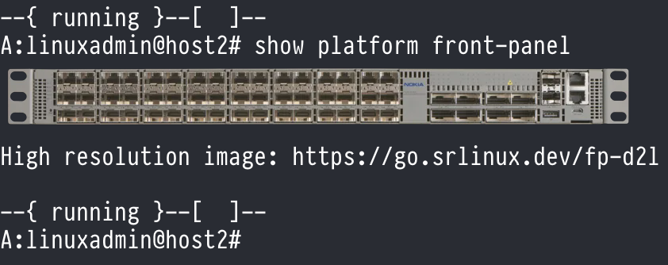

# Show SR Linux front panel in your terminal

[![Discord][discord-svg]][discord-url] [![Codespaces][codespaces-svg]][codespaces-url]  
![w212][w212][Learn more](https://containerlab.dev/manual/codespaces)

[discord-svg]: https://gitlab.com/rdodin/pics/-/wikis/uploads/b822984bc95d77ba92d50109c66c7afe/join-discord-btn.svg
[discord-url]: https://discord.gg/tZvgjQ6PZf
[codespaces-svg]: https://gitlab.com/rdodin/pics/-/wikis/uploads/80546a8c7cda8bb14aa799d26f55bd83/run-codespaces-btn.svg
[codespaces-url]: https://codespaces.new/srl-labs/ndk-frontpanel-go?quickstart=1&devcontainer_path=.devcontainer%2Fdevcontainer.json
[w212]: https://gitlab.com/rdodin/pics/-/wikis/uploads/718a32dfa2b375cb07bcac50ae32964a/w212h1.svg

This is a simple demo [NetOps Development Kit](https://learn.srlinux.dev/ndk/) (NDK)-based application for SR Linux, which displays the front panel of the network device in your terminal using terminal image protocols ([kitty graphics protocol]((https://sw.kovidgoyal.net/kitty/graphics-protocol/)) and iTerm inline images / OSC 1337).

The repository comes complete with a lab to try out the NDK application in action.

## Requirements

This repository is best tried out on Linux - either on a VM or bare metal works fine.

You will need to have a working installation of [Golang](https://go.dev/doc/install) and [Docker](https://docs.docker.com/engine/install/) to build this application.  
The rest of the tooling used during build and packaging are pulled from public container repository images.

To try out the application, you will also need to have [Containerlab](https://containerlab.dev/install/) installed (0.68.0 or newer).  
Additionally, _you must use a terminal application that supports either kitty graphics protocol or iTerm inline images (OSC 1337) to be able to see the embedded images in the CLI output._

A short list of terminals with kitty graphics protocol support:

**Mac:**

- Ghostty
- KiTTY
- iTerm2

**Linux:**

- Ghostty
- KiTTY
- Konsole

**Cross-platform:**

- WezTerm

**Note**: VS Code Integrated Terminal does not support kitty graphics protocol, but supports iTerm inline images when `"terminal.integrated.enableImages"` setting is enabled.

## Building and deploying

The helper script `run.sh` can help you build and package the app, and deploy a Containerlab topology with the NDK app pre-loaded in it.

The `./run.sh deploy-all` command builds and packages the app, deploys a test topology, installs the app on the `frontpanel` Containerlab node.

Manual build steps

First, template the files using the `./run.sh template-files` command.  
Then, simply run `./run.sh build-app` to compile the application, the compiled executable can be found in `./build/`.  
To deploy a Containerlab topology and install the application onto it, run `./run.sh deploy-lab`, and then `./run.sh install-app`.

After making changes to the application's code, it can be rebuilt and redeployed with the command `./run.sh redeploy-app`.

To create a package ready for installation on an SR Linux node, run `./run.sh package`, which will output the Debian package to `./build/`. This .deb package can then be installed by copying it onto an SR Linux node and running `dpkg -i ./ndk-frontpanel-go*.deb`.

## Usage

The NDK front panel application is made of 3 components:

- The NDK binary `frontpanel`  
This binary is responsible for two things: exposing the state of the NDK application via the YANG model, and outputting the terminal-graphics-coded front panel image. You can try the latter functionality out by running `frontpanel -image "7220 IXR-D2L"`.

The image protocol can be selected with:

- `-image-protocol auto|kitty|iterm` (default `auto`)
- `FRONTPANEL_IMAGE_PROTOCOL=kitty|iterm` (env override)

Examples:

- `frontpanel -image "7220 IXR-D2L" -image-protocol iterm`
- `FRONTPANEL_IMAGE_PROTOCOL=iterm frontpanel -image "7220 IXR-D2L"`

- The Python CLI plugin `show-frontpanel.py`  
This simple Python CLI plugin adds the `show platform front-panel` command, which displays the front-panel by calling the NDK binary with the `-image` flag, and adds the URL as exposed by the application's YANG model to the output.

The plugin auto-selects `kitty` when `TERM` indicates kitty or ghostty; otherwise it uses `iterm` (OSC 1337), which works better over SSH in terminals like VS Code.
You can override this with `FRONTPANEL_IMAGE_PROTOCOL=kitty|iterm|auto`.

- The YANG model `frontpanel.yang`  
This YANG model exposes the state of the application in the `/platform/front-panel` container. The container contains a single leaf, `url`, pointing to an URL of a high resolution image of the SR Linux node's front panel, for easier overview.

After the NDK application is installed, simply run `show platform front-panel`!

## Cleanup

To destroy the test lab, run `./run.sh destroy-lab`.
